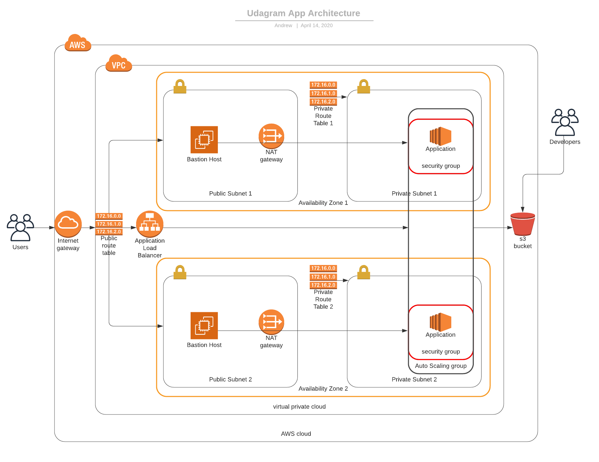

# Deplying a High Availability Web App using Cloudformation

## The Task:

Your company is creating an Instagram clone called Udagram. Developers pushed the latest version of their code in a zip file located in a public S3 Bucket.

You have been tasked with deploying the application, along with the necessary supporting software into its matching infrastructure.

This needs to be done in an automated fashion so that the infrastructure can be discarded as soon as the testing team finishes their tests and gathers their results.

### Project Requirements

> ##### The Basics

|CRITERIA|MEETS SPECIFICATIONS|
|---|---|
|Parameters| The more the better, but an exaggerated number of parameters can be messy ( say, 10 or more ). 1 or 0 is definitely lacking.|
|Resources|This is the mandatory section of the script, we are looking for a LoadBalancer, Launch Configuration, AutoScaling group a health check, security groups and a Listener and Target Group.|
|Outputs|This is optional, but it would be nice to have a URL here with the Load Balancer DNS Name and “http” in front of it .|
|Working Test|If the student provides a URL to verify his work is running properly, it will be a page that says “it works! Udagram, Udacity”|

> ##### Load Balancer

|CRITERIA|MEETS SPECIFICATIONS|
|---|---|
|Target Group|The auto-scaling group needs to have a property that associates it with a target group. The Load Balancer will have a Listener rule associated with the same target group|
|Health Check and Listener|Port 80 should be used in Security groups, health checks and listeners associated with the load balancer|

> ##### Auto-Scaling

|CRITERIA|MEETS SPECIFICATIONS|
|---|---|
|Subnets|Students should be using PRIV-NET ( private subnets ) for their auto-scaling instances|
|Machine Specs|The machine should have 10 GB or more of disk and should be a t3.small or better.|
|SSH Key|There shouldn’t be a ‘keyname’ property in the launch config|

> ##### Bonus

|CRITERIA|MEETS SPECIFICATIONS|
|---|---|
|Output|Any values in the output section are a bonus|
|Bastion Host|Any resource of type AWS::EC2::Instance, optional, but nice to have.|

## My Solution

### Architecture Diagram

### Instructions

**1.** Create an S3 bucket and upload the index.zip file. Change the index.zip file's location in the launch configuration's user script.

**2.** Create a key pair for your Bastion Hosts in case you need to SSH into your private subnet instances and change the `KeyPair` parameter in the server-parameters.json file to your newly created key pair.

**3.** Open up a terminal window and run `./create INSERTNAME network.yml network-parameters.json`. This will create a Cloudformation stack named INSERTNAME for your network architecture.

**4.** In the same terminal window run `./create INSERTNAME2 servers.yml server-parameters.json`. This will create a Cloudformation stack named INSERTNAME2 for your application servers, jump boxes, security groups, auto scaling group, and load balancer.
